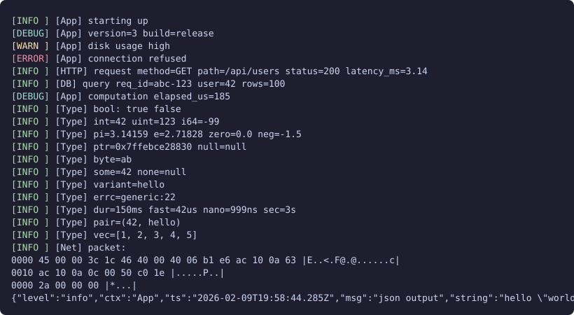

# log.h ^_^

single-header c++23 structured logger. zero allocations, ~100ns/call. simd-accelerated when available. logs to stderr via raw `syscall` on x86-64 linux.

needs c++23 (gcc 14+ / clang 18+) and linux.

## demo



```cpp
#include "log.h"

Log::info("App", "starting up");
Log::debug("App", "version=", 3, " build=", "release");
Log::warning("App", "disk usage high");
Log::error("App", "connection refused");

// structured fields
Log::info("HTTP", "req",
    Log::kv("method", "GET"), Log::kv("status", 200), Log::kv("ms", 3.14));

// scoped fields — stick to every log call until scope ends
{
    auto s = Log::Scope(Log::kv("req", "abc-123"));
    Log::info("DB", "query", Log::kv("rows", 100));
}

// timer — logs elapsed on destruction
{ auto t = Log::Timer("App", "work"); }

// all the types — just pass them in
Log::info("T", "bool=", true, " int=", 42, " pi=", 3.14);
Log::info("T", "ptr=", (void*)&x, " null=", nullptr, " byte=", std::byte{0xAB});
Log::info("T", "opt=", std::optional{42}, " none=", std::optional<int>{});
Log::info("T", "var=", std::variant<int,std::string>{"hello"});
Log::info("T", "ec=", std::errc::invalid_argument, " dur=", 42ms);
Log::info("T", "vec=", std::vector{1,2,3}, " pair=", std::pair{1,"x"});
Log::info("T", "path=", std::filesystem::path{"/tmp"});
Log::info("Net", "pkt:\n", Log::hexdump(buf, len));

// json mode
Log::setFormat(Log::JSON);
Log::info("App", "msg", Log::kv("k", "v"));
// {"level":"info","ctx":"App","msg":"msg","k":"v"}

// source location
Log::info(Log::Loc{}, "App", "here");  // [INFO ] [App] here (main.cpp:42)

// runtime config
Log::setMinLevel(Log::Warning);
Log::setTimestamps(true);
Log::setColors(true);              // or Log::autoDetectColors()
Log::setThreadId(true);
Log::setContextFilter("App,-DB");  // allow App, block DB

// sampling + rate limiting + conditional macros
if (Log::sample<100>()) Log::debug("Hot", "1-in-100");
LOG_RATE_LIMITED_MS(info, 1000, "Ctx", "once per second");
LOG_ONCE(info, "Ctx", "first time only");
LOG_FIRST_N(info, 5, "Ctx", "first 5");
LOG_EVERY_N(info, 100, "Ctx", "every 100th");
LOG_IF(warning, x > limit, "Ctx", "over limit");
LOG_ASSERT(ptr, "Ctx", "shouldn't be null");
LOG_DLOG("Ctx", "compiled out when LOG_LEVEL > 0");
```

auto-detected if available: `expected`, `mdspan`, `stacktrace`, `std::format` fallback

## build

```
make run-example
make run-bench
./bench.sh
```

## config macros

- `LOG_LEVEL` (default 0) — compile-time min level, 0-3. below is compiled out.
- `LOG_MAX_SCOPED` (default 8) — max scoped fields per thread
- `LOG_MAX_FILTERS` (default 16) — max context filter entries
- `LOG_NO_GLOBAL_USING` — keep `Log` out of global namespace

## simd

uses sse2/ssse3/sse4.2/avx2 progressively for json escaping, hex encoding, digit packing, context filter hashing, and fast copies. all optional, scalar fallback always works.
